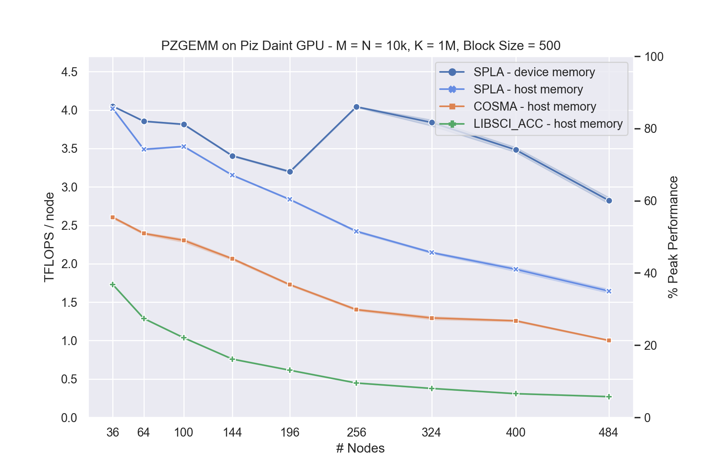

[](https://github.com/eth-cscs/spla/actions?query=workflow%3ACI)
[](https://spla.readthedocs.io/en/latest/?badge=latest)

# SPLA - Specialized Parallel Linear Algebra
SPLA provides specialized functions for linear algebra computations with a C++ and C interface, which are inspired by requirements in computational material science codes.

Currently, SPLA provides functions for distributed matrix multiplications with specific matrix distributions, which cannot be used directly with a ScaLAPACK interface.
All computations can optionally utilize GPUs through CUDA or ROCm, where matrices can be located either in host or device memory.

## GEMM
The function `gemm(...)` computes a local general matrix product, that works similar to cuBLASXt. If GPU support is enabled, the function may take any combination of host and device pointer. In addition, it may use custom multi-threading for host computations, if the provided BLAS library does not support multi-threading.

### Stripe-Stripe-Block
The `pgemm_ssb(...)` function computes


where matrices A and B are stored in a "stripe" distribution with variable block length. Matrix C can be in any supported block distribution, including the block-cyclic ScaLAPACK layout. Matrix A may be read as transposed or conjugate transposed.


                     ------ T     ------
                     |    |       |    |
                     |    |       |    |
                     ------       ------
     -------         |    |       |    |        -------
     |  |  |         |    |       |    |        |  |  |
     -------   <--   ------   *   ------    +   -------
     |  |  |         |    |       |    |        |  |  |
     -------         |    |       |    |        -------
        C            ------       ------           C
                     |    |       |    |
                     |    |       |    |
                     ------       ------
                       A            B

For computation of triangular block distributed matrices, the `pgemm_ssbtr(...)` function is available, allowing to specify the fill mode of C.

### Stripe-Block-Stripe
The `pgemm_sbs(...)` function computes


where matrices A and C are stored in a "stripe" distribution with variable block length. Matrix B can be in any supported block distribution, including the block-cyclic ScaLAPACK layout.

     ------         ------                     ------
     |    |         |    |                     |    |
     |    |         |    |                     |    |
     ------         ------                     ------
     |    |         |    |       -------       |    |
     |    |         |    |       |  |  |       |    |
     ------   <--   ------   *   -------   +   ------
     |    |         |    |       |  |  |       |    |
     |    |         |    |       -------       |    |
     ------         ------          B          ------
     |    |         |    |                     |    |
     |    |         |    |                     |    |
     ------         ------                     ------
       C               A                         C

## Documentation
Documentation can be found [here](https://spla.readthedocs.io/en/latest/).

## Installation
The build system follows the standard CMake workflow. Example:
```console
mkdir build
cd build
cmake .. -DSPLA_OMP=ON -DSPLA_GPU_BACKEND=CUDA -DCMAKE_INSTALL_PREFIX=${path_to_install_to}
make -j8 install
```

### CMake options
| Option                |  Values                                                  | Default | Description                                      |
|-----------------------|----------------------------------------------------------|---------|--------------------------------------------------|
| SPLA_OMP              |  ON, OFF                                                 | ON      | Enable multi-threading with OpenMP               |
| SPLA_HOST_BLAS        |  AUTO, MKL, OPENBLAS, BLIS, CRAY_LIBSCI, ATLAS, GENERIC  | AUTO    | BLAS library for computations on host            |
| SPLA_GPU_BACKEND      |  OFF, CUDA, ROCM                                         | OFF     | Select GPU backend                               |
| SPLA_BUILD_TESTS      |  ON, OFF                                                 | OFF     | Build test executables                           |
| SPLA_INSTALL          |  ON, OFF                                                 | ON      | Add library to install target                    |
| SPLA_FORTRAN          |  ON, OFF                                                 | OFF     | Build Fortan module                              |

## Performance



## Acknowledgements
This work was supported by:


| | [**Swiss Federal Institute of Technology in Zurich**](https://www.ethz.ch/) |
|:----:|:----:|
| | [**Swiss National Supercomputing Centre**](https://www.cscs.ch/)            |
|  | [**MAterials design at the eXascale**](http://www.max-centre.eu) <br> (Horizon2020, grant agreement MaX CoE, No. 824143) |
